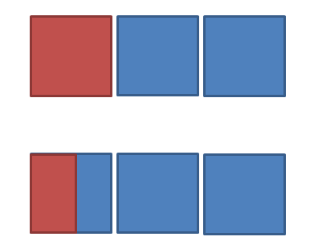

> 这部分内容来自于《Python极客编程 用代码探索世界》的第1章<用贝叶斯法则营救失事船只的船员>。
>
> 项目与基础的理论（确实非常基础，甚至于书中提供的理论可以说是非常不完善的，这其实给项目的实践带来了不小的问题）来自于该书，但是在具体实现时，我们遵循书中提供的框架，而具体的代码实现很大程度是脱离书本的————也就是说，我们不应该一边读书一边把代码“复制”到我们自己的IDE中。
>
> 关于项目背后的理论支持，我们更倾向于需要做一些额外的探索，比如在这个项目中，我们可以找一些有关贝叶斯搜索算法的paper进行阅读，当然另一种做法就是完全接受书中的做法而不考虑其中的理论是不是对的或者是如何得到的，但是这样的话收获可能比较小。当然，选择先接受理论，然后做好实践工作，再回过头来去看理论是否完善也是一个不错的做法。
>
> 此外需要说明的是，在实际的代码编写过程中，可以看到教材上原有的代码存在一种很不好的习惯，即对几个形式上完全相同的结构的定义是分开进行的，我们在实际实现时用容器组织起了这些结构，之后通过循环可以一次性处理这些结构而不需要单独进行处理，优化之后的代码更加简练，更重要的是新的代码的灵活性大大增加了。

### 1. 项目描述

就像题目中所说，这个项目是在模拟营救失事船员，其中假定了3个搜索区域，用户拥有两个搜索队，可以在一次搜索中任意指派（包括将两个搜索队派到同一区域）。程序最开始会给出失事船员在3个区域的概率，而失事船员的真实位置也会通过三角分布随机产生（需要保证随机数生成概率大致上满足最开始时先验给出的概率）。比较有趣的一点是，对某个区域的搜索不会是完全进行的，在原始的项目中，对某个区域进行搜索之前，会随机生成一个搜索有效性概率SEP，假定对区域1，SEP=0.8，那么也就意味着这次针对区域1的搜索只能覆盖80%。我们需要做的就是用一个图形界面配合用户进行模拟搜索，并在每次搜索失败之后更新失事船员在这3个区域的概率。

的确，这样的思想很符合贝叶斯法则，但其实对于这种加入了SEP的搜索，我们完全不需要考虑贝叶斯公式就能得到概率的更新法则（接下来我们会详细描述）。

此外，考虑到原有项目中SEP随机生成这一点比较无趣，我们会考虑加入一个天气系统，为3个区域分配两种天气（好与坏），天气的出现只取决于这一区域之前的天气状况；然后再根据天气状况通过三角分布产生对应的SEP。

### 2. 区域概率的更新方式

<div align="center">

</div>

---

如上图所示。每一排都有3个矩形，用来模拟3个搜索区域。

我们先不考虑SEP，这样就像上面那排所示的情况，区域1被完全搜索（红色），假定原先目标在3个区域的概率是$p_1, p_2, p_3$，那么更新后的概率公式如下：

$$
p^{new}_1 = 0
$$

$$
p^{new}_2 = \cfrac{p_2}{p_2+p_3}
$$

$$
p^{new}_3 = \cfrac{p_3}{p_2+p_3}
$$

接下来考虑加入了SEP的情况，如下面那一排矩形那样，红色依旧表示进行了搜索的区域，这样的话，更新之后的公式如下：

$$
p^{new}_1 = \cfrac{p_1 (1-SEP_1)}{p_1 (1-SEP_1) + p_2 + p_3}
$$

$$
p^{new}_2 = \cfrac{p_2}{p_1 (1-SEP_1) + p_2 + p_3}
$$

$$
p^{new}_3 = \cfrac{p_3}{p_1 (1-SEP_1) + p_2 + p_3}
$$

当我们用面积去考虑概率时，这样的公式很容易得到，并且实际上如果将未进行搜索的区域的SEP定为0的话，我们可以得到如下的统一公式：

$$
p_i^{new} = \cfrac{p_i(1-SEP_i）}{\Sigma_{j=1}^n p_j (1-SEP_j)}
$$

上面的公式就可以用来处理两个搜索队的情况了，但我们还需要考虑两个搜索队在同一个区域的情况，这时只需要更新该区域的SEP就可以了，更新的方式也需要用面积去考虑：

<div align="center">

</div>

---

像这样，两次相同SEP的搜索在同一个区域发生了重叠，那么新的SEP就只需要用两次搜索的面积的并集除以整个区域面积就可以得到，而对应的概率更新公式直接使用新的SEP即可。

**完全不需要贝叶斯公式！只需要面积！**

最后我们来考虑一下整个搜索过程，其实不难发现，在公式给出的结果中，每次搜索之后全集$\Omega$都会被缩小，但下一次的搜索实际上还是在原来的全集上进行的，因此搜索结果才会出现更多的可能性。

我们在模拟中不会尝试修正这种冗余的搜索————毕竟，现实往往都是充满着冗余的。

### 3. 编程技巧

这部分内容将描述项目使用到的那些我们依旧不是很熟悉的编程技巧；这些内容虽然不是最重要的，但也是非常重要的。

#### （1）三角分布

一种非常好用的用于控制整数随机数生成的分布：

```python
random.triangular(low, high, mode)
```

关于三角分布，我们再about_triangular.py文件中给出了一个用于可视化三角分布生成随机整数的例子，在这里用一张图片也可以很好的描述：

<div align="center">

</div>

#### （2）网格坐标

通过itertools可以快速生成网格坐标，一段示例程序如下：

```python
>>> import itertools
>>> x = [1, 2]
>>> y = [4, 5]
>>> xAndy = list(itertools.product(x, y))
>>> xAndy
[(1, 4), (1, 5), (2, 4), (2, 5)]
```

#### （3）退出程序

向sys.exit()传入参数1可以让程序因错误而终止，对应的，可以在之前相关的print函数中指定file=sys.stderr，这样在解释器中print函数打印出来的“错误信息”就是红色的了。
