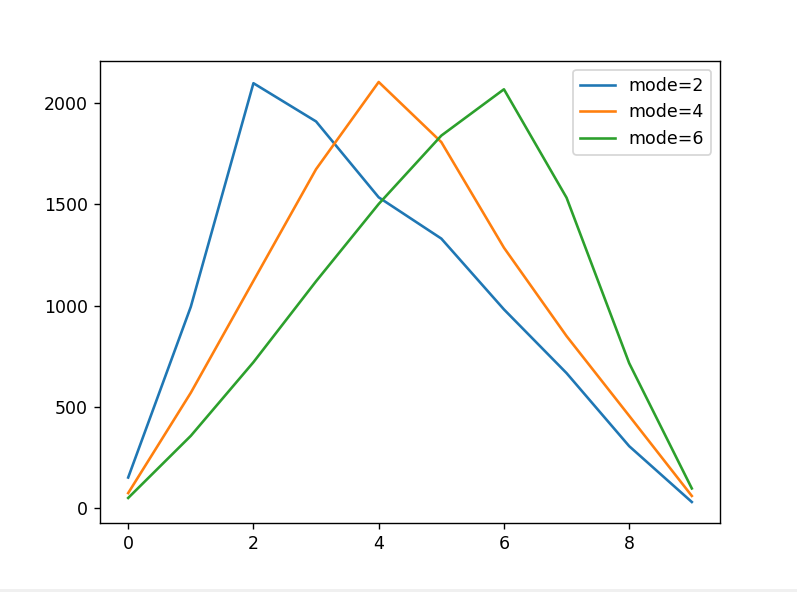

> *以下内容来自于对《Python极客编程 用代码探索世界》中的第一章：用贝叶斯法则营救失事船只的船员。*

## 阅读笔记

**贝叶斯法则展示了用于接受新的数据和重新计算概率估计的数学上的正确方法。**

### 1. 贝叶斯法则，先验以及后验

这里先给出贝叶斯法则：

$$
P(A|B)=P(B|A)\cfrac{P(A)}{P(B)}
$$

从右向左：

* $P(A)$是没有新数据时假设的概率，称之为**先验**；
* $P(B)$是看见新数据的总体概率，称之为**边际似然**；
* $P(B|A)$是给定最初假设时看见新数据的概率，称之为**似然**；
* $P(A|B)$是接受了新数据之后重新预估的概率，称之为**后验**；

也就是说，贝叶斯法则给出了通过先验计算后验的一种方法。


### 2. 一些编程基础/技巧

*这一部分将描述阅读过程中看到的不熟悉的编程技巧。需要说明的是，我们期望的流程是先阅读整个项目（至少是一个完整的模块）的代码，然后尝试自己去进行实现，而不是看到书上的源代码、把它们抄写在自己的IDE中。*

#### （1）在解释器中打印错误信息并退出

```python
print('something about error', file=sys.stderr)
sys.exit(1)
```

输出一条错误信息，然后用sys.exit()退出程序。1代表程序以错误方式终止；file=stderr参数会在Python解释器窗口中按照“错误红”文本颜色进行打印。

#### (2)三角分布

```python
random.triangular(low, high, mode)
```

用于生成三角分布，mode默认值是（low+high）/2。

<p align = "center">    

</p>

#### (3)网格迭代器

```python
itertools.product(x, y)
```

通过Python标准库itertools来生成序列x和y的网格坐标，返回一个迭代器。


